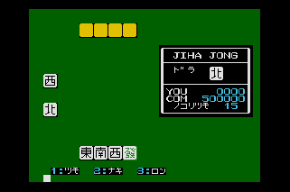
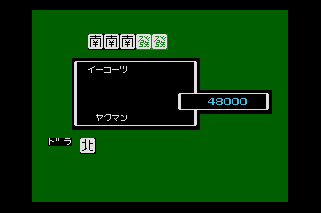
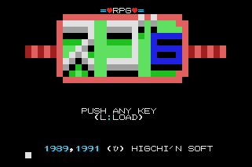

# MSX Games 1989
MSX Games created in 1989

-----

## JIHA JONG : 字牌雀
 
- 説明
  - 字牌のみでおこなう麻雀です。
  - 手牌は４枚、上がって５枚となります。
  - 役はもう、昔に作ったので忘れましたが
  - 「一三元」「対三元」「一四喜」「対四喜」「明槓子」「暗槓子」等等
- Source: <a href="https://www.minagi.jp/apps/mbv/?basic_url=https://xionchannel.github.io/MSX_repo/JIHA/AUTOEXEC.BAS">View with MSX BASIC Viewer (ver1.0)</a>
- Source: ver2.0 <a href="https://github.com/xionchannel/MSX_repo/blob/master/JIHA/AUTOEXEC_MSXPEN.BAS">/JIHA/AUTOEXEC_MSXPEN.BAS</a>
- Source: ver2.0(English) <a href="https://github.com/xionchannel/MSX_repo/blob/master/JIHA/AUTOEXEC_E_MSXPEN.BAS">/JIHA/AUTOEXEC_E_MSXPEN.BAS</a>
- WebMSX: <a href="https://webmsx.org/?MACHINE=MSX2J&STATE_URL=https://xionchannel.github.io/MSX_repo/JIHA/JIHAJAN2.wst">Play with WebMSX (Japanese Version)</a>
- WebMSX: <a href="https://webmsx.org/?MACHINE=MSX2J&STATE_URL=https://xionchannel.github.io/MSX_repo/JIHA/JIHAJAN2E.wst">Play with WebMSX (English Version)</a>

## RPG SUGO6 : RPG スゴ6
 
- 説明
  - 二人で遊ぶゲームです(^^;
  - 双六のようにさいころを振って移動し、止まったところの指示にしたがい、最終的に左下隅にいるボスを倒すというゲームです。
- Source: <a href="https://www.minagi.jp/apps/mbv/?basic_url=https://xionchannel.github.io/MSX_repo/SUGO6/AUTOEXEC.BAS">View with MSX BASIC Viewer</a>
- Source: ver2.0 <a href="https://github.com/xionchannel/MSX_repo/blob/master/SUGO6/AUTOEXEC_MSXPEN.BAS">View with MSX BASIC Viewer</a>
- WebMSX: <a href="https://webmsx.org/?MACHINE=MSX2J&STATE_URL=https://xionchannel.github.io/MSX_repo/SUGO6/SUGO62.wst">Play with WebMSX(New Version)</a>
- WebMSX: <a href="https://webmsx.org/?MACHINE=MSX2J&DISK=https://xionchannel.github.io/MSX_repo/SUGO6/SUGO6.DSK">Play with WebMSX(OLD Version)</a>

## WIZARD BUSTER I
 
- 操作方法
  1. フィールド移動
     - 移動先を、十字カーソルを動かしスペースを押すことで決定します。途中に障害物がないかぎり、目的地に向かって進みます。
  2. 町または城、砦
     - 右上端にある、コマンドウインドウからコマンドを選んで、スペースで決定します。
  3. 戦闘シーン
     - 同じく、右上端のウインドウで選択しますが、主人公の行動を２ステップ先までの選択になります。
- ヒント
  - 城の生き残りの兵士を褒めると回復するぞ！
  - ウィスプを倒すと経験値がたっぷり！
- WebMSX: <a href="https://webmsx.org/?MACHINE=MSX2J&DISK=https://xionchannel.github.io/MSX_repo/WIZ1/WIZ1.DSK">Play with WebMSX</a>
