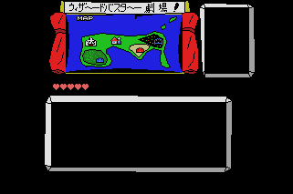

# MSX Games 1989
MSX Games created in 1989

-----

## JIHA JONG : 字牌雀
 
- Source: <a href="https://www.minagi.jp/apps/mbv/?basic_url=https://xionchannel.github.io/MSX_repo/JIHA/AUTOEXEC.BAS">View with MSX BASIC Viewer</a>
- WebMSX: <a href="https://webmsx.org/?MACHINE=MSX2J&DISK=https://xionchannel.github.io/MSX_repo/JIHA/JIHAJAN.DSK">Play with WebMSX</a>

## RPG SUGO6 : RPG スゴ6
 
- Source: <a href="https://www.minagi.jp/apps/mbv/?basic_url=https://xionchannel.github.io/MSX_repo/SUGO6/AUTOEXEC.BAS">View with MSX BASIC Viewer</a>
- WebMSX: <a href="https://webmsx.org/?MACHINE=MSX2J&DISK=https://xionchannel.github.io/MSX_repo/SUGO6/SUGO6.DSK">Play with WebMSX</a>

## WIZARD BUSTER I
 
- WebMSX: <a href="https://webmsx.org/?MACHINE=MSX2J&DISK=https://xionchannel.github.io/MSX_repo/WIZ1/WIZ1.DSK">Play with WebMSX</a>
